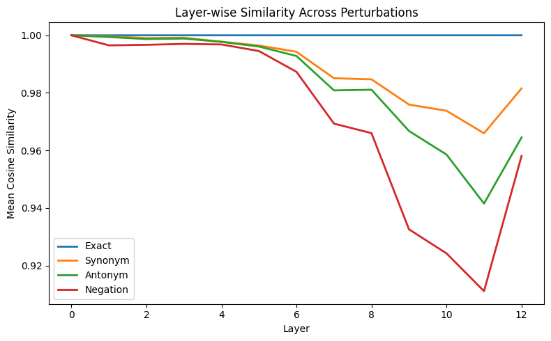
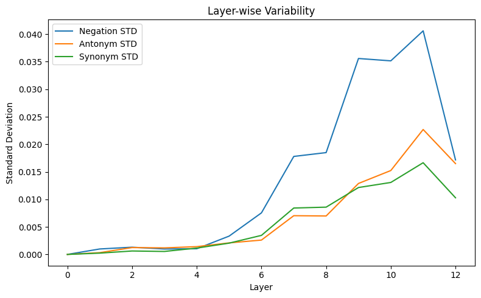

# BERT Layer-wise Similarity Analysis

## About the Project

This project studies how sentence representations change across different layers of BERT.

Instead of looking only at the final embedding, I extract the CLS token from every layer and measure how similar two sentences are at each stage of the model.

The goal is to understand how meaning differences appear gradually inside the transformer.

The focus is not benchmark performance, but understanding internal representation behavior.

## Motivation

Most similarity-based NLP work focuses only on the final sentence embedding.  
However, transformer models process information step by step across multiple layers.

I wanted to explore a simple question:

- At which layer do meaningful differences between sentences begin to appear?

For example:
- Does negation immediately change the representation?
- Do antonyms separate strongly in deeper layers?
- Do synonyms remain close throughout the model?

By looking layer by layer, we can get a clearer picture of how the model organizes meaning internally.

## Method

- Used `bert-base-uncased` from HuggingFace  
- Enabled hidden states  
- Extracted CLS vector from all 13 layers (embedding + 12 transformer layers)  
- Computed cosine similarity for each layer  
- Compared results across different sentence types  

No fine-tuning was done.  
This is purely an analysis of the pretrained model.

## Dataset

I created small controlled sentence pairs in four categories:

- Exact match  
- Synonyms  
- Antonyms  
- Negation  

All sentences follow the same format:
- First letter capitalized  
- Full stop at the end  
- No extra punctuation  

This keeps the comparison fair.

## How Similarity is Measured

Cosine similarity is used to compare CLS vectors at each layer.

Higher value → more similar direction  
Lower value → more separation  

For each category:
- Mean similarity per layer is computed  
- Standard deviation is plotted  
- Paired t-tests are performed against exact pairs  

## Results

The layer-wise similarity curves show a clear and consistent pattern.

In the embedding layer (Layer 0), all categories have almost identical similarity values. This is expected because surface-level token information dominates at this stage.

From Layers 1 to 4, small differences begin to appear. Synonym, antonym, and negation pairs start to separate slightly from exact matches, but the overall similarity remains high.

The most noticeable changes occur in the middle and deeper layers (approximately Layers 7–11):

- **Synonym pairs** remain highly similar across all layers, but show a gradual and consistent drop compared to exact matches. This indicates that even small lexical substitutions create measurable changes in representation.

- **Antonym pairs** show a stronger and more consistent separation, especially in deeper layers. The similarity drop is larger than that observed for synonyms, suggesting that opposite meanings are increasingly distinguished as the model processes context.

- **Negation pairs** show the largest divergence from exact matches in deeper layers. The drop in similarity becomes more pronounced around Layers 8–11, indicating that negation significantly alters the internal representation.

Overall, early layers behave more lexically, while deeper layers show clearer semantic differentiation. The separation between categories becomes stronger as we move upward in the network.

Paired t-tests confirm that the differences from exact pairs are statistically significant across most layers (excluding Layer 0).

These results suggest that deeper transformer layers capture stronger semantic distinctions, while early layers preserve surface level similarity.

## Plots

Layer-wise Similarity Comparison:

Standard Deviation Plot:

## Key Insights

- Representation differences grow gradually across layers rather than appearing instantly.
- Deeper layers show clearer semantic separation than early layers.
- Negation and antonym substitutions create stronger geometric shifts than synonym substitutions.
- Even small lexical changes produce consistent changes in internal representations.

## Limitations

- The dataset is small and manually created for controlled testing.
- Only one model (`bert-base-uncased`) is analyzed.
- Only the CLS token representation is used (no mean pooling comparison).
- This is a representation analysis, not a task performance evaluation.

This project is intended as a controlled probing analysis rather than a large-scale evaluation.

## Future Work

- Extend the study to larger datasets.
- Compare CLS with mean pooling representations.
- Analyze attention weights alongside similarity.
- Compare results across different transformer models.

## Project Structure

bert_layerwise_negation/

- data/  
  - exact_pairs.json  
  - synonym_pairs.json  
  - antonym_pairs.json  
  - negation_pairs.json  

- models/  
  - bert_probe.py  

- utils/  
  - metrics.py  

- experiments/  
  - testing.ipynb  
  - run_analysis.ipynb  

- results/  
  - similarity_results.csv  
  - negation_mean_std.png
  - layerwise_comparison.png

- README.md  
- requirements.txt

## How to Run

1. Install dependencies:

  - pip install -r requirements.txt

2. Open:

  - experiments/run_analysis.ipynb

3. Run all cells to reproduce the analysis.
